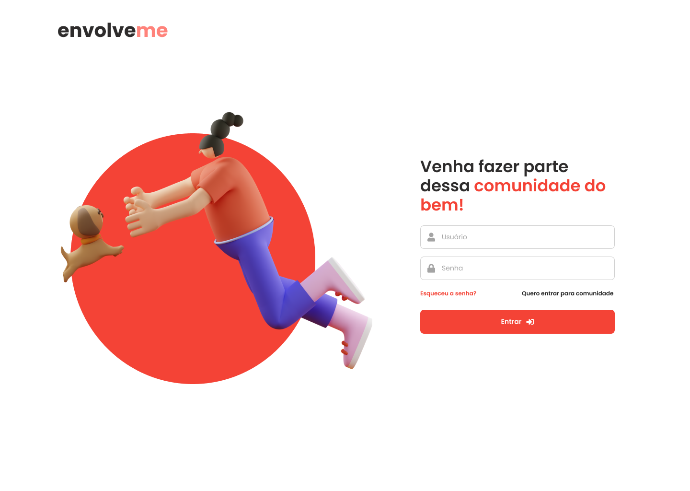
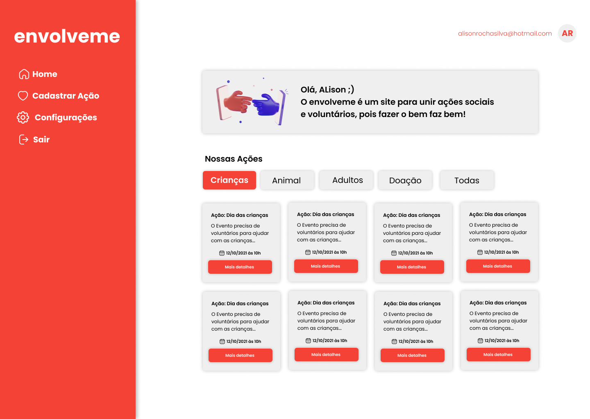

<h1 align="center">
  
</h1>

  <a href="#-tecnologias">Tecnologias</a>&nbsp;&nbsp;&nbsp;|&nbsp;&nbsp;&nbsp;
  <a href="#-projeto">Projeto</a>&nbsp;&nbsp;&nbsp;|&nbsp;&nbsp;&nbsp;
  <a href="#-layout">Layout</a>&nbsp;&nbsp;&nbsp;|&nbsp;&nbsp;&nbsp;  

 

  

 

  
  
  

## 🚀 Tecnologias

Esse projeto foi desenvolvido com as seguintes tecnologias:

- HTML
- CSS
- JavaScript
- SQLite Browser

## 💻 Projeto

O Envolveme é uma aplicação para conectar ações sociais com voluntários.

- Área de Login
- Opção de adicionar nova ação social
- Opção de visualizar todas as ações sociais por categoria

## 🔖 Layout

Você pode visualizar o layout do projeto através [desse link](https://www.figma.com/file/SiYsv4WbTTBa8jbQZyDoEk/envolve.me?node-id=1417%3A3). É necessário ter conta no [Figma](https://figma.com) para acessá-lo.

---

Feito com ♥ by Alison Rocha
